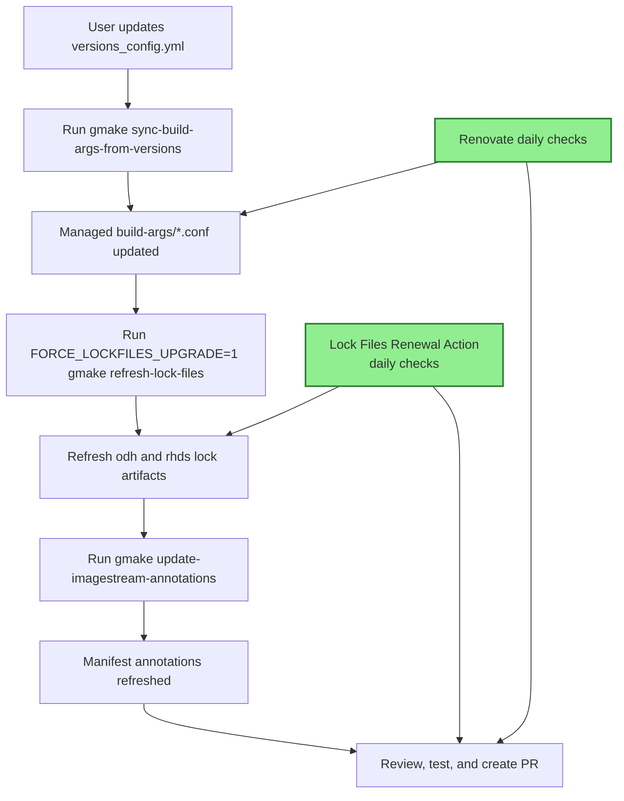

# Automation Flow Overview

This document is the high-level presentation view for the update flow for AIPCC artifacts that should be **done quarterly**. 

It is intentionally focused on the operator journey and how the major actions connect, without going deep into parser or implementation details.
 
**Spike Investigation branch:** https://github.com/opendatahub-io/notebooks/compare/main...atheo89:notebooks:automation?expand=1 

## Big Picture

Bellow are the separated steps for better understanding. These steps can also be run also under one command that bundles all the required steps moving from 3.5 to 3.6:

### Quarterly shot: Kick off the new release

1. A user  updates the `versions_config.yml` with the desired versions for each
core image family. 

2. second step is to run `gmake sync-build-args-from-versions` to update the managed 
`build-args/*.conf` files. (**Needs to be implemented**)

3. After that step means that we have new base images and eventually new indexes so we will need a full upgrade on the pylock files by  `FORCE_LOCKFILES_UPGRADE=1 gmake refresh-lock-files` to refresh the Python lock artifacts. (**Needs upgrades** (dynamic index resolution and dual lock (odh:pypi, rhds:rh-index)))

4. After that step we will need to shift down the old tags (N-1) on the manifests files by running `gmake create-new-tags` (New latest tag N 3.6, Old tag N-1 3.5) (**Needs to be implemented**)

6. It should follow the run `gmake update-imagestream-annotations` to refresh manifest annotations annotations from the new lock data. (**Already implemented**) 

5. The user reviews, tests, and opens a PR.

  

### In parallel, daily scheduled automations helps keep the repo moving (EA1 -> EA2, tag updates, pylock renewal):

- [Renovatebot](https://github.com/opendatahub-io/notebooks/actions/workflows/renovate-self-hosted.yaml) checks for new image tags on a daily schedule.

- The [Lock Files Renewal Action](https://github.com/opendatahub-io/notebooks/actions/workflows/piplock-renewal.yaml)

runs on a schedule or manually to refresh lockfiles, regenerate generated files, update annotations, and open a PR.

  

## High-Level Flow Diagram

  



  

## `versions_config.yml` Is the Main Interface

  

`versions_config.yml` is now the main operator entry point. The user only needs to declare the desired versions for the main image families, such as:

- Main Release version
- OS base (el9.6 etc)
- CPU, CUDA, and ROCm accelerator versions per family and per stream (odh, rhds)

  This keeps the change surface small and gives the team a single place to start from when preparing an update.

  
## Sync the managed build args (to be implemented)

  
After editing the config, the next step is:


```bash

gmake  sync-build-args-from-versions

```

  
At a high level of the functionalities that the , `scripts/update_build_args_from_versions.py` does:

- validates the structure of `versions_config.yml`
- scans the managed  `build-args/*.conf` files
- updates `BASE_IMAGE` 
- resolves the latest published RHDS tag for the exact rewritten version and phase family by using `skopeo`

  In simple terms, this step turns the user intent from `versions_config.yml` into the concrete build inputs consumed by the image trees.
  

## Refresh the Lock Files (needs upgrades)

After the build-args are aligned, the next step is:

```bash

FORCE_LOCKFILES_UPGRADE=1  gmake  refresh-lock-files

```
  

At a high level, the lock refresh flow should:
 
- reads `PROFILE` and `BASE_IMAGE` from the updated build-args
- resolves the effective package index dynamically at lock time
  - uses the public PyPI index for `odh`
  - uses the RHDS index for `rhds`, derived from `BASE_IMAGE`
- prefers the production RHDS index and falls back to `-test` when production is not available
- generates the profile-specific lock artifacts:
  -  `pylock.odh.*` / `requirements.odh.*`
  -  `pylock.rhds.*` / `requirements.rhds.*`

## Kick off new release tag  (to be implemented)

Makefile recipe: 
  ```bash

gmake create-new-tags

```

At a high level this should:
-   add a new section tag for X.Y as new N
-   shift the previous N down now as N−1 and remove the third
-   update all n-1 *_PLACEHOLDERS to correspond to X-Y 
-   update params.env and commit.env with the new key values from the latest release:  
-   update the kustomization.yaml 
-   update CI if it's needed

## Refresh Manifest Annotations (already implemented)

  Once the lock files are updated, the next step is:

  ```bash

gmake  update-imagestream-annotations

```

At a high level, this step:
- reads the refreshed lock artifacts
- updates the ImageStream dependency annotations in the manifest files
- keeps `notebook-python-dependencies` aligned with the lock content
- keeps the Python stack portion of `notebook-software` aligned as well
  
This is the bridge between lock generation and the deployment-facing manifest layer.

  
##  Recurring Automated Maintenance

The repo now has two recurring automation tracks.
  

### Renovate updates (daily)

The Renovate self-hosted workflow runs on a daily schedule and advances managed Konflux `BASE_IMAGE` references when newer published tags and prereleases are available.

At a high level, Renovate handles the day-to-day tag movement, while `versions_config.yml` remains the place where the team makes intentional planned version changes.

### Lock file renewal workflow (daily)

- can be triggered manually
- also runs on a schedule
- refreshes lock files
- regenerates Dockerfiles and kustomization outputs that depend on lock content
- updates ImageStream annotations
- validates manifests
- opens an automated PR when changes are produced
  
## Final hybrid agentic automation 

Hybrid automation lets an agent or workflow prepare the release safely without publishing it directly. It updates `versions_config.yml`, runs build-args sync, refreshes lockfiles, updates manifest annotations, validates results, and opens a PR. After team review and merge, the existing release workflows create and publish the final release artifact later automatically.