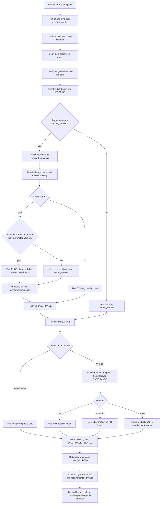

# Build-Args and Lockfile Automation

This document describes the automation flow implemented on this branch for:

- syncing `build-args/*.conf` from `versions_config.yml`
- deriving RHDS and ODH Python indexes
- splitting lockfiles by profile
- keeping Dockerfile and helper consumers aligned with the new artifact names

## Goals

The automation work on this branch has four main goals:

1. Make `versions_config.yml` the operator-facing entry point for routine image/index updates.
2. Keep `BASE_IMAGE`, `INDEX_URL`, and `PROFILE` values synchronized across all supported `build-args/*.conf` files.
3. Split generated Python lock artifacts into explicit `odh` and `rhds` profiles.
4. Preserve RHDS release/phase behavior that still needs to cooperate with Renovate-driven image tag bumps.

## Main Entry Points

- Config: `versions_config.yml`
- Sync command: `gmake sync-build-args-from-versions`
- Sync implementation: `scripts/update_build_args_from_versions.py`
- Lock refresh command: `gmake refresh-lock-files`
- Lock generator: `scripts/pylocks_generator.py`

## End-to-End Flow



## Current Design

### 1. Central configuration model

`versions_config.yml` now controls:

- `release.full_version`
- `release.rhds_os_base`
- `python_index.rhds.mode/channel`
- `python_index.odh.mode/url`
- `artifacts.base_image.*` accelerator versions

The sync script validates this structure before touching any `*.conf` files.

### 2. Target discovery and classification

`scripts/update_build_args_from_versions.py` scans every `build-args/*.conf` file under the repo and classifies each target by:

- filename: `cpu.conf`, `cuda.conf`, `rocm.conf`, `konflux.cpu.conf`, `konflux.cuda.conf`, `konflux.rocm.conf`
- path: used to infer flavor like `minimal`, `pytorch`, `tensorflow`, or `pytorch-llmcompressor`
- distribution: `odh` for non-Konflux, `rhds` for Konflux

It also handles `base-images/build-args/*.conf` as index-only targets with static stream tokens like `cpu`, `cuda12.9`, `cuda13.0`, and `rocm7.1`.

### 3. `PROFILE` is now a first-class build input

The sync inserts or updates `PROFILE` in each managed `*.conf` file:

- `PROFILE=odh` for non-Konflux / public profile
- `PROFILE=rhds` for Konflux / RHDS profile

This keeps Dockerfiles and helper scripts on one shared pattern:

- `uv.lock.d/pylock.${PROFILE}.${PYLOCK_FLAVOR}.toml`
- `requirements.${PROFILE}.${PYLOCK_FLAVOR}.txt`

### 4. RHDS release precedence

`release.full_version` is now authoritative for RHDS release version changes.

For Konflux targets, the sync:

1. reads the current RHDS tag from `BASE_IMAGE`
2. compares the current tag version against `release.full_version`
3. rewrites the tag version to `release.full_version`
4. preserves the existing build/timestamp suffix
5. derives `INDEX_URL` from the rewritten `BASE_IMAGE`

This keeps RHDS `BASE_IMAGE` and `INDEX_URL` aligned.

### 5. RHDS phase selection rules

The RHDS phase logic now behaves like this:

- If `release.full_version` is greater than the current RHDS tag version:
  - use `--rhds-phase` when provided
  - otherwise default to `ea.1`
- If `release.full_version` is equal to or lower than the current RHDS tag version:
  - keep the current phase from `BASE_IMAGE`
  - ignore `--rhds-phase`

Accepted override forms include:

- `ea.1`
- `ea1`
- `ea2`
- `ga`

Examples:

- `3.4.0 -> 3.5.0` with no override becomes `3.5.0-ea.1-...`
- `3.4.0 -> 3.5.0 --rhds-phase ea2` becomes `3.5.0-ea.2-...`
- `3.4.0 -> 3.5.0 --rhds-phase ga` becomes `3.5.0-...`
- `3.5.0-ea.1 -> 3.5.0-ea.2` is still left to Renovate because the version did not increase

### 6. RHDS index resolution

`python_index.rhds` uses `mode: rh-index` with:

- `channel: test`
- `channel: production`
- `channel: auto`

When `channel: auto` is selected, the script probes the production RH index first and falls back to `*-test` when production is not available.

The release segment used in the RH index is taken from the resolved RHDS `BASE_IMAGE`:

- `3.5.0-ea.1-...` -> `3.5-EA1`
- `3.5.0-ea.2-...` -> `3.5-EA2`
- `3.5.0-...` -> `3.5`

### 7. ODH index resolution

`python_index.odh` uses `mode: public-index` and an explicit `url`, which currently points to public PyPI.

Non-Konflux `*.conf` files use that URL directly.

## Lockfile Split and Naming

The lockfile side of the branch now uses explicit profile-specific artifacts:

- ODH/public:
  - `uv.lock.d/pylock.odh.<flavor>.toml`
  - `requirements.odh.<flavor>.txt`
- RHDS/Konflux:
  - `uv.lock.d/pylock.rhds.<flavor>.toml`
  - `requirements.rhds.<flavor>.txt`

Important branch changes:

- repo-owned public profile naming was renamed from `pypi` to `odh`
- canonical artifact names now always include the profile
- legacy generic RHDS alias generation was removed from `scripts/pylocks_generator.py`

Some read-side helper fallbacks may still tolerate old generic filenames in older trees, but new generation is profile-specific.

## Downstream Consumers Updated on This Branch

The automation branch also aligned the main consumers of lock artifacts:

- Dockerfiles now use `PROFILE` with a shared `COPY` pattern
- `scripts/dockerfile_fragments.py` prefers `pylock.odh.*` or `pylock.rhds.*`
- `manifests/tools/update_imagestream_annotations_from_pylock.py` prefers profile-specific lockfiles
- `scripts/lockfile-generators/create-requirements-lockfile.sh` now resolves profile-specific filenames
- tests covering build-args sync, lock generation, manifest selection, and Dockerfile fragment resolution were updated accordingly

## Operational Runbook

### Normal update flow

1. Edit `versions_config.yml`.
2. Run:

   ```bash
   gmake sync-build-args-from-versions
   ```

3. If you are moving RHDS to a new release line and want a non-default phase, run:

   ```bash
   gmake sync-build-args-from-versions SYNC_BUILD_ARGS_ARGS="--rhds-phase ea2"
   ```

   or:

   ```bash
   gmake sync-build-args-from-versions SYNC_BUILD_ARGS_ARGS="--rhds-phase ga"
   ```

4. Review the updated `build-args/*.conf` files.
5. If any `INDEX_URL` or lock inputs changed, regenerate locks:

   ```bash
   gmake refresh-lock-files
   ```

6. Run focused or broader verification as needed.

### Expected RHDS behavior

- New RHDS release line bump: `full_version` drives the tag version
- Same RHDS release line: Renovate keeps driving `ea.1 -> ea.2 -> ga`
- ODH/public side: `versions_config.yml` directly controls the public index and accelerator versions

## Planning Notes

### What is complete on this branch

- central `versions_config.yml` schema for build-args automation
- automatic sync of `BASE_IMAGE`, `INDEX_URL`, and `PROFILE`
- RHDS release precedence moved to `release.full_version`
- RHDS phase override support via `--rhds-phase`
- auto/test/production RH index channel handling
- split `odh` / `rhds` lockfile generation
- unified Dockerfile artifact lookup through `PROFILE`
- removal of legacy RHDS compatibility alias generation

### Known trade-off

When `release.full_version` increases to a new RHDS release line, the sync preserves the old build/timestamp suffix while rewriting the version and selected phase.

This is intentionally lightweight, but it can temporarily point `BASE_IMAGE` at a tag that does not exist yet until Renovate catches up with a real image tag carrying the new suffix.

### GitHub Actions integration point

There is no dedicated workflow input wired for this automation yet.

The current branch is prepared for future workflow integration because the sync script already accepts:

```bash
./uv run scripts/update_build_args_from_versions.py --rhds-phase ea2
```

A future `workflow_dispatch` wrapper can expose that as a workflow input without changing the core sync logic again.

### Recommended next follow-up

If this automation should be triggerable from GitHub Actions, add a wrapper workflow or extend an existing workflow to expose:

- the config path, if needed
- optional `rhds_phase`
- optional dry-run / check mode

That workflow should simply pass the selected input through to `scripts/update_build_args_from_versions.py`.

## Related Files

- `versions_config.yml`
- `scripts/update_build_args_from_versions.py`
- `scripts/pylocks_generator.py`
- `scripts/dockerfile_fragments.py`
- `scripts/lockfile-generators/create-requirements-lockfile.sh`
- `manifests/tools/update_imagestream_annotations_from_pylock.py`
- `Makefile`
