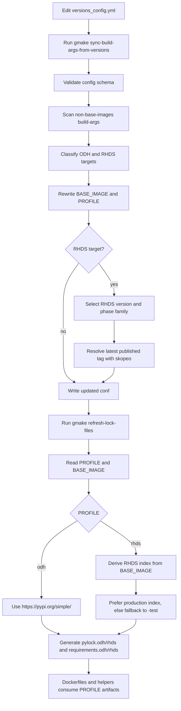

# Automation Branch README

This document is the branch-level README for the build-args and lockfile
automation work that was introduced on this branch.

It describes the operator-facing workflow, the new source-of-truth rules, and
the major implementation changes across build-args sync, lock generation, and
downstream consumers.

## What Changed

This branch introduced the following enhancements:

- `versions_config.yml` is the operator-facing source of truth for routine image updates.
- non-`base-images` `build-args/*.conf` files are now synced from config and only keep the inputs that matter:
  - `BASE_IMAGE`
  - `PROFILE`
  - `PYLOCK_FLAVOR`
- stored `INDEX_URL` was removed from non-`base-images` build-args and from `versions_config.yml`.
- Python package index resolution is now dynamic:
  - `PROFILE=odh` always uses `https://pypi.org/simple/`
  - `PROFILE=rhds` derives the RHDS index from `BASE_IMAGE`
- lock artifacts are now split by explicit profile:
  - `pylock.odh.*` / `requirements.odh.*`
  - `pylock.rhds.*` / `requirements.rhds.*`
- repo-owned profile naming was normalized from `pypi` to `odh`.
- Dockerfiles and helper scripts were unified around `PROFILE`.
- RHDS release version precedence moved to `release.full_version`.
- RHDS phase selection supports:
  - default `ea.1` on release-line increase
  - explicit `--rhds-phase`
  - preserving the current phase when the version did not increase
- Konflux / RHDS build-args now resolve the latest published image tag for the rewritten exact version+phase family by using `skopeo list-tags`.
- lock generation now prints the exact resolved lock index URL in logs for both ODH/PyPI and RHDS.

## Main Entry Points

- Config: `versions_config.yml`
- Build-args sync command: `gmake sync-build-args-from-versions`
- Build-args sync implementation: `scripts/update_build_args_from_versions.py`
- Lock refresh command: `gmake refresh-lock-files`
- Lock generator: `scripts/pylocks_generator.py`
- Shared index resolver: `scripts/index_url_resolver.py`

## End-to-End Flow



## Source of Truth

### `versions_config.yml`

`versions_config.yml` now controls:

- `release.full_version`
- `release.rhds_os_base`
- `artifacts.base_image.*` accelerator versions

It no longer contains:

- `python_index`
- stored `INDEX_URL` values

### Non-`base-images` build-args

After sync, non-`base-images` `build-args/*.conf` files keep:

- `BASE_IMAGE`
- `PROFILE`
- `PYLOCK_FLAVOR`

They do not keep:

- `INDEX_URL`

### Out of Scope

This automation intentionally does not manage:

- `base-images/build-args/*.conf`

## Build-Args Sync Behavior

The sync script in `scripts/update_build_args_from_versions.py`:

- scans all supported `build-args/*.conf` files
- classifies each target from its filename and path
- infers:
  - accelerator
  - distribution (`odh` or `rhds`)
  - flavor (`minimal`, `pytorch`, `tensorflow`, `pytorch-llmcompressor`, or CPU/no flavor)
- inserts or updates `PROFILE`
- rewrites `BASE_IMAGE`
- removes stale `INDEX_URL` from non-`base-images` confs

Supported managed target families:

- `jupyter/**/build-args/*.conf`
- `runtimes/**/build-args/*.conf`
- `codeserver/**/build-args/*.conf`
- `rstudio/**/build-args/*.conf`

## RHDS Release and Phase Rules

For Konflux / `rhds` targets:

- `release.full_version` is authoritative for the RHDS release version.
- If `release.full_version` is greater than the current RHDS tag version:
  - use `--rhds-phase` when provided
  - otherwise default to `ea.1`
- If `release.full_version` is equal to or lower than the current RHDS tag version:
  - keep the current phase from `BASE_IMAGE`
  - ignore `--rhds-phase`

Accepted override forms:

- `ea.1`
- `ea1`
- `ea2`
- `ga`

Examples:

- `3.4.0 -> 3.5.0` becomes `3.5.0-ea.1-*` by default
- `3.4.0 -> 3.5.0 --rhds-phase ea2` becomes `3.5.0-ea.2-*`
- `3.4.0 -> 3.5.0 --rhds-phase ga` becomes `3.5.0-*`
- `3.5.0-ea.1 -> 3.5.0-ea.2` remains Renovate-managed when the version did not increase

## RHDS Latest Published Tag Lookup

This branch adds a second RHDS-only resolution step after `BASE_IMAGE` is rewritten.

For Konflux targets, the updater now:

1. rewrites the RHDS image repo and desired tag family from config
2. uses `skopeo list-tags` against the rewritten repo
3. filters tags by the exact rewritten version+phase family
4. picks the highest numeric build/timestamp suffix
5. writes that fully resolved latest published `BASE_IMAGE`

Examples of exact-family matching:

- EA family: `^3.6.0-ea.1-(\\d+)$`
- GA family: `^3.6.0-(\\d+)$`

Important behavior:

- no phase jump is allowed during lookup
- `3.6.0-ea.1-*` only searches `3.6.0-ea.1-*`
- `3.6.0-*` only searches GA tags
- if `skopeo` fails, is missing, or no matching published tag exists, sync fails intentionally

This removes the earlier trade-off where a rewritten RHDS tag could temporarily keep an old suffix that did not exist on the registry.

## Dynamic Index Resolution

### ODH / Public

For `PROFILE=odh`, the effective index is always:

- `https://pypi.org/simple/`

### RHDS

For `PROFILE=rhds`, the effective index is derived dynamically from `BASE_IMAGE`.

The resolver:

- parses the RHDS release version and phase from the image tag
- parses the stream token from the image name
- builds the RHDS production URL
- falls back to the `*-test` variant when production is not available

Release segment examples:

- `3.5.0-ea.1-...` -> `3.5-EA1`
- `3.5.0-ea.2-...` -> `3.5-EA2`
- `3.5.0-...` -> `3.5`

Stream token examples:

- `quay.io/aipcc/base-images/cpu:3.5.0-ea.1-1777920678` -> `cpu`
- `quay.io/aipcc/base-images/cuda-12.9-el9.6:3.5.0-ea.1-1777919771` -> `cuda12.9`
- `quay.io/aipcc/base-images/cuda-13.0-el9.6:3.5.0-ea.2-1779234676` -> `cuda13.0`
- `quay.io/aipcc/base-images/rocm-7.1-el9.6:3.5.0-17779163874` -> `rocm7.1`

## Lockfile Split and `PROFILE`

The branch now uses explicit profile-specific artifacts:

- ODH / public
  - `uv.lock.d/pylock.odh.<flavor>.toml`
  - `requirements.odh.<flavor>.txt`
- RHDS / Konflux
  - `uv.lock.d/pylock.rhds.<flavor>.toml`
  - `requirements.rhds.<flavor>.txt`

`PROFILE` is now a first-class build input:

- `PROFILE=odh` for non-Konflux flows
- `PROFILE=rhds` for Konflux flows

That keeps Dockerfiles and helpers on one pattern:

- `uv.lock.d/pylock.${PROFILE}.${PYLOCK_FLAVOR}.toml`
- `requirements.${PROFILE}.${PYLOCK_FLAVOR}.txt`

Additional naming changes:

- repo-owned profile naming was renamed from `pypi` to `odh`
- legacy generic RHDS alias generation was removed

## Downstream Consumers Updated on This Branch

The branch also aligned the main lockfile consumers:

- Dockerfiles now use `PROFILE` with a shared `COPY` pattern
- `scripts/dockerfile_fragments.py` prefers `pylock.odh.*` and `pylock.rhds.*`
- `manifests/tools/update_imagestream_annotations_from_pylock.py` prefers profile-specific artifacts
- `scripts/lockfile-generators/create-requirements-lockfile.sh` resolves the effective index dynamically from `PROFILE` and `BASE_IMAGE`

## Logging Improvements

Lock generation now prints the full resolved lock index URL before building the
`uv` flags.

Examples:

```text
PyPI lock index URL: https://pypi.org/simple/?format=json
RH index lock URL: https://console.redhat.com/api/pypi/public-rhai/rhoai/3.5-EA1/cpu-ubi9/simple/?format=json
```

This applies to the effective URL that is actually passed to lock generation.

## Normal Operator Workflow

1. Edit `versions_config.yml`.
2. Sync build-args:

   ```bash
   gmake sync-build-args-from-versions
   ```

3. If you are bumping to a new RHDS release line and want a non-default phase:

   ```bash
   gmake sync-build-args-from-versions SYNC_BUILD_ARGS_ARGS="--rhds-phase ea2"
   ```

   or:

   ```bash
   gmake sync-build-args-from-versions SYNC_BUILD_ARGS_ARGS="--rhds-phase ga"
   ```

4. Review the updated `build-args/*.conf` files.
5. Refresh lock files when needed:

   ```bash
   gmake refresh-lock-files
   ```

6. Run focused or broader verification.

Useful direct checks:

```bash
./uv run scripts/update_build_args_from_versions.py --check
./uv run pytest tests/unit/scripts/test_update_build_args_from_versions.py -q
./uv run pytest tests/unit/scripts/test_pylocks_generator.py -q
./uv run pytest tests/unit/scripts/test_create_requirements_lockfile.py -q
```

## Operational Notes

- Konflux / RHDS sync now requires:
  - registry access
  - `skopeo` on `PATH`
- ODH / non-Konflux sync does not use RHDS latest-tag lookup.
- `base-images/build-args/*.conf` remain out of scope.
- lock generation derives the effective index at runtime; it is no longer stored in non-`base-images` build-args.

## Key Files

- `versions_config.yml`
- `scripts/update_build_args_from_versions.py`
- `scripts/index_url_resolver.py`
- `scripts/pylocks_generator.py`
- `scripts/dockerfile_fragments.py`
- `scripts/lockfile-generators/create-requirements-lockfile.sh`
- `manifests/tools/update_imagestream_annotations_from_pylock.py`
- `Makefile`

## Summary

This branch turns the build-args and lockfile flow into a config-driven pipeline
with clear ownership boundaries:

- `versions_config.yml` owns the desired image configuration
- build-args sync owns `BASE_IMAGE` and `PROFILE`
- lock generation owns dynamic index resolution
- RHDS Konflux sync now resolves a real published latest tag instead of keeping an old suffix
- downstream consumers now operate on explicit `odh` and `rhds` artifacts
