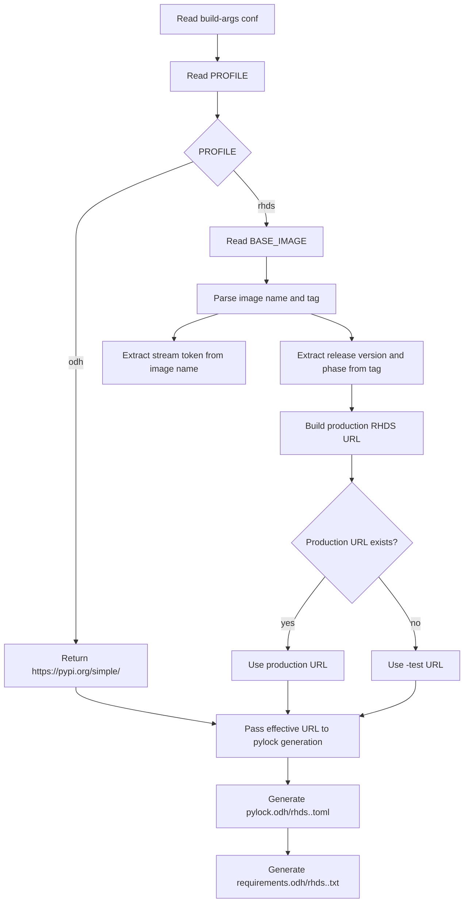

# Dynamic INDEX_URL Removal Design

## Summary

This design removes stored `INDEX_URL` values from all non-`base-images` `build-args/*.conf` files and from `versions_config.yml`.

Instead of storing the effective index URL, the lock-generation flow will derive it dynamically from:

- `PROFILE`
- `BASE_IMAGE`

`base-images/build-args/*.conf` files are explicitly out of scope for this change and remain unchanged.

## Problem

The current automation stores `INDEX_URL` in many non-`base-images` `*.conf` files even though:

- the RHDS URL prefix is constant
- the RHDS release segment already follows the `BASE_IMAGE` tag
- the public ODH index is always `https://pypi.org/simple/`

That duplicates state across:

- `versions_config.yml`
- `build-args/*.conf`
- `scripts/update_build_args_from_versions.py`
- `scripts/pylocks_generator.py`
- `scripts/lockfile-generators/create-requirements-lockfile.sh`

The result is avoidable drift and more update surfaces than necessary.

## Goals

1. Remove stored `INDEX_URL` from all non-`base-images` `build-args/*.conf`.
2. Remove `python_index` from `versions_config.yml`.
3. Derive the effective lock-generation index dynamically from `PROFILE` and `BASE_IMAGE`.
4. Preserve the existing RHDS production-probe fallback to `-test`.
5. Keep `base-images/build-args/*.conf` out of scope.

## Non-Goals

1. Do not change `base-images/build-args/*.conf`.
2. Do not redesign the existing RHDS `release.full_version` / `--rhds-phase` behavior.
3. Do not change the split lockfile naming scheme (`odh` / `rhds`).

## Approved Scope

The design applies to:

- `jupyter/**/build-args/*.conf`
- `runtimes/**/build-args/*.conf`
- `codeserver/**/build-args/*.conf`
- `rstudio/**/build-args/*.conf`
- `scripts/update_build_args_from_versions.py`
- `scripts/pylocks_generator.py`
- `scripts/lockfile-generators/create-requirements-lockfile.sh`
- related tests and docs

The design does not apply to:

- `base-images/build-args/*.conf`
- base-image Dockerfile `ARG INDEX_URL` handling

## Source of Truth After This Change

### ODH/public

- `PROFILE=odh`
- effective index: `https://pypi.org/simple/`

### RHDS

- `PROFILE=rhds`
- `BASE_IMAGE` determines:
  - release line
  - phase (`EA1`, `EA2`, or GA)
  - stream token (`cpu`, `cuda12.9`, `cuda13.0`, `rocm7.1`)
- production URL is preferred when available
- otherwise fallback to `-test`

## Proposed Architecture

### 1. Remove index config from user-facing inputs

`versions_config.yml` will no longer carry:

- `python_index.rhds`
- `python_index.odh`

`scripts/update_build_args_from_versions.py` will stop writing `INDEX_URL` for non-`base-images` targets.

After sync, non-`base-images` `*.conf` files will keep only the inputs that still matter:

- `BASE_IMAGE`
- `PROFILE`
- `PYLOCK_FLAVOR`

### 2. Add one shared dynamic resolver

Introduce a shared Python helper module for computing the effective Python index from `PROFILE` and `BASE_IMAGE`.

Suggested shape:

```python
resolve_effective_index_url(profile: str, base_image: str, *, probe_production: bool = True) -> str
```

Suggested responsibilities:

- parse RHDS `BASE_IMAGE` tag version and phase
- parse RHDS stream token from image name
- return `https://pypi.org/simple/` for `odh`
- construct the RHDS URL for `rhds`
- probe production first, then fallback to `-test`

This keeps the parsing logic in one place instead of duplicating it in multiple scripts.

### 3. Reuse the resolver in all non-base-images lock consumers

#### `scripts/pylocks_generator.py`

Replace the current `INDEX_URL` reads from conf files with:

- read `PROFILE`
- read `BASE_IMAGE`
- compute the effective index URL dynamically

This affects:

- lock generation (`--default-index=...`)
- requirements generation (`pylock-to-requirements.py` input URL)

#### `scripts/lockfile-generators/create-requirements-lockfile.sh`

Stop sourcing `INDEX_URL` from the conf file.

Instead:

- source `PROFILE`
- source `BASE_IMAGE`
- call the shared Python resolver to get the effective URL when needed

The shell script should not re-implement RHDS parsing in bash.

### 4. Keep update-build-args focused on build inputs

`scripts/update_build_args_from_versions.py` should continue to manage:

- `BASE_IMAGE`
- `PROFILE`

It should stop managing:

- `INDEX_URL` for non-`base-images` targets

This makes the updater responsible for build inputs only, while lock-generation consumers compute the runtime-effective index themselves.

## Dynamic Resolution Rules

### ODH/public profile

If:

- `PROFILE=odh`

Then:

- effective index is always `https://pypi.org/simple/`

### RHDS profile

If:

- `PROFILE=rhds`

Then:

1. Parse the RHDS release from `BASE_IMAGE`
2. Parse the stream token from `BASE_IMAGE`
3. Build the production RHDS URL
4. If production exists, use it
5. Otherwise use the `-test` variant

### Stream token mapping

Examples:

- `quay.io/aipcc/base-images/cpu:3.5.0-ea.1-1777920678` -> `cpu`
- `quay.io/aipcc/base-images/cuda-12.9-el9.6:3.5.0-ea.1-1777919771` -> `cuda12.9`
- `quay.io/aipcc/base-images/cuda-13.0-el9.6:3.5.0-ea.2-1779234676` -> `cuda13.0`
- `quay.io/aipcc/base-images/rocm-7.1-el9.6:3.5.0-17779163874` -> `rocm7.1`

### Release segment mapping

Examples:

- `3.5.0-ea.1-...` -> `3.5-EA1`
- `3.5.0-ea.2-...` -> `3.5-EA2`
- `3.5.0-...` -> `3.5`

## Flow Diagram



## File-Level Design Changes

### `versions_config.yml`

Remove:

- `python_index`

Keep:

- `release.full_version`
- `release.rhds_os_base`
- `artifacts.base_image`

### `scripts/update_build_args_from_versions.py`

Remove responsibilities:

- parsing `python_index`
- computing non-`base-images` `INDEX_URL`
- writing `INDEX_URL` into non-`base-images` conf files

Keep responsibilities:

- config validation for remaining fields
- target discovery
- `BASE_IMAGE` rewriting
- `PROFILE` insertion/update
- RHDS release/phase precedence behavior

### `scripts/pylocks_generator.py`

Replace current behavior:

- read `INDEX_URL` from conf

With:

- read `PROFILE`
- read `BASE_IMAGE`
- compute effective URL dynamically

### `scripts/lockfile-generators/create-requirements-lockfile.sh`

Replace current behavior:

- source `INDEX_URL`

With:

- source `PROFILE`
- source `BASE_IMAGE`
- call a Python helper for effective URL resolution

### Tests

Update tests to cover:

- no `INDEX_URL` written by the build-args sync for non-`base-images` targets
- ODH/public dynamic resolution from `PROFILE=odh`
- RHDS dynamic resolution from `PROFILE=rhds` + `BASE_IMAGE`
- production fallback to `-test`
- shell helper behavior without stored `INDEX_URL`
- search-level verification that non-`base-images` conf files no longer contain `INDEX_URL`

### Docs

Update:

- `docs/build-args-and-lockfile-automation.md`
- `docs/packageupdate.md`
- any script help text or README snippets that still describe `INDEX_URL` as a non-`base-images` conf input

## Migration Plan

1. Add the shared resolver module.
2. Refactor `scripts/pylocks_generator.py` to use it.
3. Refactor `scripts/lockfile-generators/create-requirements-lockfile.sh` to use it via Python.
4. Remove `INDEX_URL` management from `scripts/update_build_args_from_versions.py`.
5. Remove `python_index` from `versions_config.yml` schema and docs.
6. Remove `INDEX_URL` from non-`base-images` `build-args/*.conf`.
7. Update tests.
8. Update docs.

## Error Handling

The shared resolver should fail fast on:

- missing `PROFILE`
- unsupported `PROFILE`
- missing `BASE_IMAGE` for `rhds`
- malformed RHDS base image names
- malformed RHDS tags

It should not fail on:

- `odh` profiles that do not need `BASE_IMAGE` for index resolution

## Risks

### 1. Hidden `INDEX_URL` consumers

There may be docs, tests, or helper paths that still assume non-`base-images` `*.conf` files carry `INDEX_URL`.

Mitigation:

- repo-wide search during implementation
- focused regression tests for the lock helpers

### 2. Logic drift if parsing is duplicated

If RHDS URL derivation is implemented once in Python and again in shell, the two paths may drift.

Mitigation:

- keep the parsing logic in one shared Python helper

### 3. Base-images confusion

This design intentionally does not touch `base-images/build-args/*.conf`.

Mitigation:

- document that exclusion clearly
- keep the implementation scoped to non-`base-images` confs

## Verification Plan

Minimum verification after implementation:

```bash
./uv run pytest tests/unit/scripts/test_update_build_args_from_versions.py -q
./uv run pytest tests/unit/scripts/test_pylocks_generator.py -q
./uv run pytest tests/unit/scripts/test_create_requirements_lockfile.py -q
```

And one search to confirm cleanup:

```bash
rg '^INDEX_URL=' jupyter runtimes codeserver rstudio
```

Expected result:

- no matches outside `base-images/`

## Next Step

Once this spec is approved for implementation, the next planning step is to break it into:

1. shared resolver introduction
2. lock generator refactor
3. helper script refactor
4. build-args sync cleanup
5. docs/test cleanup
